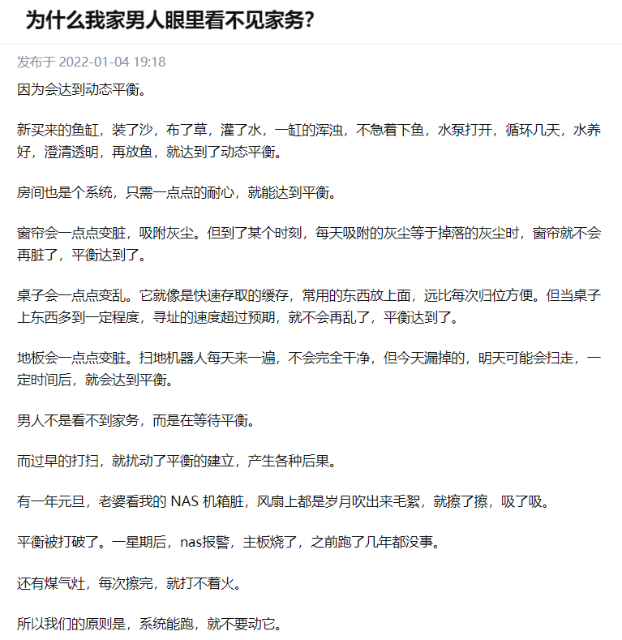

摘自 [**为什么我家男人眼里看不见家务？ **](https://www.zhihu.com/question/365708407)

动态平衡不是静止，而是各种运动态相互抵消，形成看似“平衡”的场景。

化学上，在一个可逆的化学反应中，当正向反应及逆向反应的反应速率相等时就会达致动态平衡。在这个状态下不论生成物及反应物的浓度均没有改变，动态一词意指两个反应仍然在持续进行而非停滞，但刚好两者的速率相等，致使各自的浓度均没有改变，达致平衡状态。

生物上，在出生率及死亡率均为等值的情况下，某物种的种群数目维持不变，就是一种动态平衡。